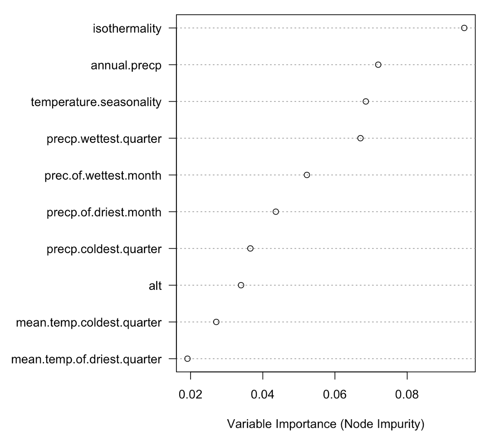

```{r setup, include=FALSE}
knitr::opts_chunk$set(root.dir = "/Users/oshin/OneDrive - LA TROBE UNIVERSITY/Onchocerciasis", echo = FALSE)
packages <- c("sf", "tmap", "mapview", "magrittr")
for (i in packages) {
  library(i, character.only = TRUE)
}
```

## Why geospatial analysis?
- Assess spatial as well as temporal variation in disease prevalence
- Identify risk factors, areas of high risk
- Allocating resources efficiently

## Research questions
>- Heterogenous/patchy prevalence of onchoceriasis

```{r, out.width='40%', fig.cap="Onchocerciasis prevalence map", fig.align="center", echo=FALSE}
knitr::include_graphics("~/OneDrive - LA TROBE UNIVERSITY/Onchocerciasis/PhD/Docs/Lab meeting - 6/Epidemiology.png")
```

## Research questions?
- What are ecological drivers of onchocerciasis prevalence?
- What are the ecological drivers vector and parasite distribution?
- Do factors affecting vector and parasite distribution also govern onchocerciasis prevalence?
- Why is the central transition zone of Ghana apparently one big fly zone, but the vector population distribution, more fragmented in Ethiopia?

# Data
## Source of data
- Database of onchocerciais prevalence data [(Hill _et. al._, 2019)](https://www.nature.com/articles/s41597-019-0079-5).
- It consists of data from 31 countries including some South American countries.
- 1900 observations from 1972 to 2015 (African countries)
    - 1669 have known GIS coordinates
    - 231 do not have GIS coordinates, but have reference to polygon shape files

## Prevalence data
```{r, echo=FALSE, warning=FALSE, message=FALSE}
d <- read.csv("oncho_point2.csv")
onchosf <- st_as_sf(x = d, coords = c('LONG','LAT'), crs= "+proj=longlat +datum=WGS84")
tmap_mode("view")
```

```{r, echo=FALSE, out.width='100%', fig.align="center", fig.cap="Onchocerciasis prevalence data divided by decades", message=FALSE}
tm_shape(onchosf) +
  #tm_basemap(leaflet::providers$OpenStreetMap) +
  tm_bubbles(size = "prev2", col = "YEAR_START")
```

<div class="centered">
Onchocerciasis prevalence data on different decades
</div>

## Prevalence data based on diagnostic tests
```{r, echo=FALSE, out.width='100%', fig.align="center", fig.cap="Onchocerciasis prevalence data divided by diagnostic tests", message=FALSE}
tm_shape(onchosf) +
  #tm_basemap(leaflet::providers$OpenStreetMap) +
  tm_bubbles(size = "prev2", col = "DX_GROUP")
```

## Counts of different diagnostic tests 
```{r, echo=FALSE, out.width='70%', fig.cap="Different diagnostic test in different decades", fig.align="center"}

```


# Building geo-spatial modelling framework

## Methods considered
- Conventional approach
    - Generalised linear model (GLM)
    - Kriging
- Machine learning approach: Random Forest models
- Bayesian approach
    - Posterior probability distribution estimation
        - By Markov Chain Monte Carlo (MCMC) simulation
        - By Integrated Nested Laplace Approximation (INLA)
        
## Data used 
- Ethiopian prevalence data
- Why Ethiopia?
    - No geospatial studies on Eastern Africa
    - Mixed endemicity with geographical diversity

## Covariates for prevalence prediction
- Climate variables from worldclim.org
- Altitude
- Population density

## Covariates for prevalence prediction
```{r, echo=FALSE, out.width='80%', fig.cap="Raster layer for some of the predictors", fig.align="center"}
knitr::include_graphics("predrast.png")
```

## Generalized linear model
```{r, include = FALSE, echo=FALSE}
eth <- read.csv("../../Data/eth_data.csv")
eth$prev2 <- eth$prev * 100
glm.model <- glm(prev2 ~ alt + isothermality + temperature.seasonality + annual.precp + popden + annual.mean.temp + alt, data = eth)
```

```{r, out.width='30%', warning=FALSE, message=FALSE}
knitr::kable(cbind(coef(glm.model), confint(glm.model)), caption = "Regression coefficients")
```

## GLM Output
```{r, echo=FALSE, warning=FALSE, message=FALSE}
source("../../Codes/custom_functions.R")
library(raster)
library(leaflet)
dglm <- raster("gmlpred.tif")
```

```{r, echo=FALSE, out.width='100%', fig.align="center", fig.cap="Predicted prevalence map by Generalized Linear Model", message=FALSE}
plotraster(dglm, "prev")
```

## Kriging
- accounts spatial autocorrelation with a variogram
```{r, echo=FALSE, out.width='60%', fig.cap="Sample variogram with different parameters", fig.align="center"}
knitr::include_graphics("vgm.png")
```

## Kriging on Ethiopian data
```{r, echo=FALSE, out.width='50%', fig.cap="Wave variogram fitted for Ethiopian prevalence data", fig.align="center"}

```

## Kriging output
```{r, echo=FALSE, warning=FALSE, message=FALSE}
ok <- raster("ordinarykriging.tif")
ok[ok<0] <- NA
```

```{r, echo=FALSE, out.width='100%', fig.align="center", fig.cap="Predicted prevalence map by Ordinary Kriging", message=FALSE}
plotraster(ok, "prev")
```

## Random Forest regression
- Machine learning techniques are well known for handling multidimensional data
- Comprised of numerous decision/regression trees
```{r, echo=FALSE, out.width='50%', fig.cap="Decrease in model prediction error with increase in number of trees", fig.align="center"}
knitr::include_graphics("rrf.png")
```

## Random forest: variable importance
```{r, echo=FALSE, out.width='50%', fig.cap="Variable importance plot", fig.align="center"}

```

## Random Forest output
```{r, echo=FALSE, warning=FALSE, message=FALSE}
rf <- raster("med_prev.tif")
```

```{r, echo=FALSE, out.width='100%', fig.align="center", fig.cap="Predicted median prevalence map by Random Forest", message=FALSE}
plotraster(rf, "median prev")
```

## Random Forest output
```{r, echo=FALSE, warning=FALSE, message=FALSE}
rf1 <- raster("ll_prev.tif")
rf2 <- raster("ul_prev.tif")
ll <- plotraster(rf1, "ll prev")
ul <- plotraster(rf2, "ul prev")
library(leafsync)
```

```{r, echo=FALSE, out.width='100%', fig.align="center", fig.cap="Predicted lower(10%) and upper(90%) limits of prevalence map by Random Forest", message=FALSE, warning=FALSE}
leafsync::sync(ll, ul)
```

## Bayesian Approach
- Realistic approach for estimation of model parameters
- Allows to incorporate prior knowledge about model parameters
```{r, echo=FALSE, out.width='50%', fig.cap="Bayesian equation for parameter estimation", fig.align="center"}
knitr::include_graphics("bayes2.png")
```

## Markov Chain Monte Carlo
- Traditionally used alogrith for calculating posterior probability
- Used by [Hanlon et. al.(2016)](https://journals.plos.org/plosntds/article?id=10.1371/journal.pntd.0004328) using package `geoRglm`
- Computationally demanding, model ran by reducing number of iterations, prediction location and number of covariates
- Priors 
    - Normal distribution for regression coefficients
    - Uniform distribution for range parameter
    
## MCMC Output
```{r, echo=FALSE, out.width='90%', fig.cap="Traceplot for parameters estimated", fig.align="center"}

```

## MCMC Output
```{r, echo=FALSE, warning=FALSE, message=FALSE}
f1 <- read.csv("MCMCpred.csv")
library(mapview)
predictionsf <- sf::st_as_sf(x = f1, coords = c('x','y'), crs= "+proj=longlat +datum=WGS84")
```

```{r, echo=FALSE, out.width='100%', fig.align="center", fig.cap="Predicted mean prevalence map by MCMC", message=FALSE}
mapview(predictionsf, zcol = 'Mean', map.types = mapviewGetOption("basemaps"))
```

## Integrated Nested Laplace Approximation (INLA)
- Faster than MCMC, allows to fit larger dataset
- Converts continuous spatial field to a discrete spatial field defined on a triangulated mesh
```{r, echo=FALSE, out.width='40%', fig.cap="Triangulated Mesh for Ethiopian prevalence data", fig.align="center"}

```

## INLA Output
```{r, include = FALSE, echo=FALSE}
f <- read.csv("inla.csv")
```

```{r, out.width='30%', warning=FALSE, message=FALSE}
knitr::kable(data.frame(f), caption = "Regression coefficients")
```


## INLA Output
```{r, echo=FALSE, warning=FALSE, message=FALSE}
rf <- raster("inlamean.tif")
```

```{r, echo=FALSE, out.width='100%', fig.align="center", fig.cap="Predicted median prevalence map by Random Forest", message=FALSE}
plotraster(rf, "mean prev")
```

## INLA output
```{r, echo=FALSE, warning=FALSE, message=FALSE}
rf1 <- raster("inla_ll.tif")
rf2 <- raster("inla_ul.tif")
ll <- plotraster(rf1, "ll prev")
ul <- plotraster(rf2, "ul prev")
```

```{r, echo=FALSE, out.width='100%', fig.align="center", fig.cap="Predicted lower(10%) and upper(90%) limits of prevalence map by Random Forest", message=FALSE, warning=FALSE}
leafsync::sync(ll, ul)
```

## Conclusion
- Bayesian methods are robust but computationally demanding
- No effective way to quantify effects of covariates with Random Forest model
- Geospatial analysis shifting towards INLA approach

## Next steps
- Curating prevalence data
- Running codes on cluster
- Setting priors
- Downloading and selecting covariates for model
- Model evaluation

# Thank you| Any Questions?